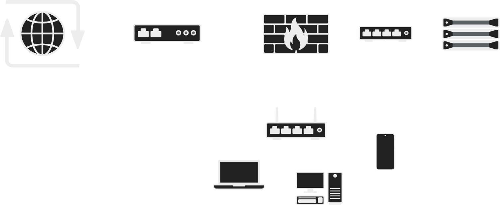

# pfSense Network Segmentation & Virtualization

## Overview
This project demonstrates **network segementation and virtualization** using a pfSense firewall deployed on a Protecli device.
The goal was to create a secure and segmented home lab environment where personal devices, virtualization infrastructure, and Windows Server VMs operate on seperate VLANs and subnets.

## Network Diagram

### Parts
 - AT&T Modem
 - pfSense Firewall (Protecli device)
 - LAN subnet
 - Proxmox subnet
 - Window VM subnet

## Features
 - Deployed pfSense firewall on Protecli device to take control of WAN from ISP modem.
 - Created multiple VLANs and subnets for traffic isolation across LAN, Proxmox, and VMs.
 - Configured firewall rules to restrict
 - Tagged Proxmox VM interfaces with VLAN IDs for proper segmentation.

## Technology Used
 - pfSense (https://www.pfsense.org/)
 - Protectli (https://protectli.com/)
 - Proxmox VE (https://www.proxmox.com/en/products/proxmox-virtual-environment/overview)
 - Windows Server VMs
 - Linux Server VMs
 - DHCP, VLANs, and Subnetting

## Setup Instructions
 1. Configure ISP modem in bridge mode/IP passthrough.
 2. Install pfSense on Protecli device.
 3. Assign WAN interface to obtain ISP public IP.
 4. Create VLANs in pfSense for:
    - LAN (personal devices)
    - Proxmox host
    - Windows Server VMs
 5. Assign VLAns to OPT interfaces and configure DHCP scopes if needed.
 6. Configure firewall rules for segmentation
    - Allow outbound internet per subnet.
    - Restrict inter-VLAN traffic unless explicitly allowed.
 7. Configure Proxmox VMs network interfaces with correct VLAN tags.

## Security
 - Default-deny policy for traffic between devices.
 - Proxmox/VM subnet isolated from personal device network.

## References
 - pfSense Documentation (https://docs.netgate.com/pfsense/en/latest/)
 - Proxmox Documentation (https://pve.proxmox.com/pve-docs/pve-admin-guide.html)
